# System Architecture Documentation: CliWrap

This document provides a architectural overview of the codebase based strictly on the dependency graph and entity structure provided.

---

## 1. Top-Level Module & Project Structure

The codebase is organized into five primary functional areas / projects:

1. **`CliWrap` (Core Library)**  
   The core execution library providingfluent APIs to construct, execute, stream, pipe, and configure CLI processes.
2. **`CliWrap.Benchmarks`**  
   Performance benchmark suites evaluating execution overhead, buffering, piping performance, and event streaming.
3. **`CliWrap.Tests`**  
   Unit and integration test suites validating execution, environment configuration, credentials, line breaks, buffering, piping, and event streams.
4. **`CliWrap.Tests.Dummy`**  
   A dummy executable application used during testing to simulate various command behaviors (e.g., echo, sleep, stdin reading, text/binary output generation).
5. **`CliWrap.Signaler`**  
   A utility project interacting with OS native methods for process signaling.

---

## 2. Core Architecture & Subsystems (`CliWrap`)

### 2.1 Command Execution Subsystem
* **`Cli`**: Entry point / helper to initiate command building.
* **`Command`**: Key abstraction composed across three primary source files:
  * `Command.cs`: Core object holding configurations (Resource Policy, Pipe Target/Source, Credentials, Environment Variables).
  * `Command.Execution.cs`: Core execution logic returning `CommandTask` and `CommandResult`.
  * `Command.PipeOperators.cs`: Operator overloads (`|`) to pipe sources and targets to commands.
* **`ICommandConfiguration.cs`**: Configuration interface exposing resource policies, piping setup, and credentials.
* **`CommandTask.cs` & `CommandResult.cs`**: Represent the async execution context and final outcome (exit code, timing, validation).
* **`CommandResultValidation.cs`**: Defines validation policies for command execution results.

### 2.2 Builders Subsystem
Provides fluent builder abstractions used by `Command.cs` to construct command options:
* `ArgumentsBuilder`
* `CredentialsBuilder`
* `EnvironmentVariablesBuilder`
* `ResourcePolicyBuilder`

### 2.3 Piping Subsystem
Abstracts standard input/output/error redirection:
* **`PipeSource`**: Manages data sources directed into standard input (stdin). Depends on `PipeTarget`, `BufferSizes`, and `Command.Execution`.
* **`PipeTarget`**: Directs stdout and stderr streams. Interacts with `SimplexStream` and `BufferSizes`.

### 2.4 High-Level Execution Extensions
* **Buffered Execution (`CliWrap/Buffered/`)**:
  * `BufferedCommandExtensions.cs`: Provides convenience methods to execute commands and buffer stdout/stderr into memory.
  * `BufferedCommandResult.cs`: Holds buffered output along with basic execution result metrics.
* **Event Streaming (`CliWrap/EventStream/`)**:
  * `CommandEvent.cs`: Models process events (`StartedCommandEvent`, `StandardOutputCommandEvent`, `StandardErrorCommandEvent`, `ExitedCommandEvent`).
  * `PullEventStreamCommandExtensions.cs` & `PushEventStreamCommandExtensions.cs`: Facilitates pulling/pushing process execution events asynchronously using channels and pipe targets.

### 2.5 Native Methods & OS Utilities
* **`NativeMethods.cs` & `WindowsSignaler.cs`**: Handle low-level OS calls and process signaling.
* **`ProcessExtensions.cs`**: Wraps process interactions using native capabilities.
* **`SimplexStream.cs` & `Channel.cs`**: In-memory async streaming and message channel infrastructure.

### 2.6 Exceptions
* **`CliWrapException`**: Base exception for the library.
* **`CommandExecutionException`**: Raised when process execution fails or returns an invalid exit code.

---

## 3. Dependency Relationship Diagram

The following Mermaid diagram maps the primary relationships between the modules and core entities within `CliWrap`.

```mermaid
graph TD
    subgraph Core ["CliWrap Core Library"]
        Cli["Cli"]
        Command["Command<br/>(Command.cs, Execution, PipeOperators)"]
        IConfig["ICommandConfiguration"]
        
        subgraph Builders ["Builders"]
            ArgBuilder["ArgumentsBuilder"]
            CredBuilder["CredentialsBuilder"]
            EnvBuilder["EnvironmentVariablesBuilder"]
            ResBuilder["ResourcePolicyBuilder"]
        end

        subgraph Piping ["Piping System"]
            PipeSource["PipeSource"]
            PipeTarget["PipeTarget"]
        end

        subgraph Extensions ["Execution Extensions"]
            Buffered["BufferedCommandExtensions / Result"]
            EventStream["Pull/Push EventStreamCommandExtensions"]
            CommandEvent["CommandEvent"]
        end

        subgraph SystemUtils ["Utils & Native"]
            ProcExt["ProcessExtensions"]
            WinSig["WindowsSignaler"]
            Native["NativeMethods"]
            Simplex["SimplexStream"]
            Chan["Channel"]
            BufSizes["BufferSizes"]
        end
        
        subgraph Diagnostics ["Exceptions & Config"]
            CmdExecExc["CommandExecutionException"]
            CliExc["CliWrapException"]
            Creds["Credentials"]
            ResPolicy["ResourcePolicy"]
            CmdResult["CommandResult"]
        end
    end

    subgraph Benchmarks ["CliWrap.Benchmarks"]
        BenchProg["Program"]
        BenchSuites["Benchmark Suites<br/>(Basic, Buffering, Piping, EventStream)"]
    end

    subgraph Tests ["CliWrap.Tests"]
        TestSpecs["Specs<br/>(Execution, Piping, Buffering, Validation, etc.)"]
    end

    subgraph TestDummy ["CliWrap.Tests.Dummy"]
        DummyProg["Program"]
        DummyCmds["Dummy Commands<br/>(Echo, Exit, Sleep, Stdin, etc.)"]
    end

    subgraph Signaler ["CliWrap.Signaler"]
        SignalerProg["Program"]
        SignalerNative["NativeMethods"]
    end

    %% Internal Core Dependencies
    Cli --> Command
    Command --> Builders
    Command --> Piping
    Command --> Creds
    Command --> ResPolicy
    Command --> CmdResult
    IConfig --> Piping
    IConfig --> Creds
    IConfig --> ResPolicy

    PipeSource --> PipeTarget
    PipeSource --> BufSizes
    PipeTarget --> Simplex
    PipeTarget --> BufSizes

    Buffered --> Command
    Buffered --> PipeTarget
    Buffered --> CmdExecExc

    EventStream --> Command
    EventStream --> PipeTarget
    EventStream --> CommandEvent
    EventStream --> Chan

    ProcExt --> WinSig
    ProcExt --> Native
    CmdExecExc --> CliExc

    %% External Project Dependencies
    BenchSuites --> BenchProg
    BenchSuites --> Command
    BenchSuites --> PipeTarget
    BenchSuites --> CommandEvent

    TestSpecs --> BenchProg
    TestSpecs --> PipeTarget
    TestSpecs --> PipeSource
    TestSpecs --> CommandEvent
    TestSpecs --> CmdExecExc

    DummyProg --> BenchProg
    DummyCmds --> Command

    SignalerProg --> BenchProg
    SignalerProg --> Native
    SignalerNative --> Native
```

---

## 4. Module Responsibilities & Key Entities

| Project / Directory | Entity / File | Dependencies | Purpose |
| :--- | :--- | :--- | :--- |
| **`CliWrap`** | `Cli` | `Command.Execution` | Entry point class for spawning CLI commands. |
| | `Command` | `ResourcePolicy`, `Credentials`, `PipeTarget`, `PipeSource`, `Builders/*`, `Command.Execution` | Primary model representing a process invocation setup. |
| | `PipeSource` / `PipeTarget` | `SimplexStream`, `BufferSizes`, `Command.Execution` | Standard input/output abstraction layers for stream redirection. |
| | `BufferedCommandExtensions` | `PipeTarget`, `Command.Execution`, `CommandTask`, `CommandExecutionException`, `BufferedCommandResult` | Helper extension to capture executed command output in memory. |
| | `EventStreamCommandExtensions` | `PipeTarget`, `Channel`, `Command.Execution`, `CommandTask`, `CommandEvent` | Extensions for pull and push-based async event streaming. |
| | `ProcessExtensions` | `NativeMethods`, `WindowsSignaler` | Utilities extending process capabilities via low-level OS interop. |
| **`CliWrap.Benchmarks`** | `Program`, `BasicBenchmarks`, `PipeToStreamBenchmarks`, etc. | `CliWrap/Command.Execution`, `CliWrap/PipeTarget`, `CliWrap/EventStream/CommandEvent` | Benchmark suite measuring core execution performance. |
| **`CliWrap.Tests`** | `ExecutionSpecs`, `PipingSpecs`, `ValidationSpecs`, etc. | `CliWrap.Benchmarks/Program`, `CliWrap/PipeSource`, `CliWrap/PipeTarget`, `CliWrap/Exceptions/CommandExecutionException` | Test suite covering library features and behavior specs. |
| **`CliWrap.Tests.Dummy`** | `Program`, `ExitCommand`, `EchoCommand`, `SleepCommand`, etc. | `CliWrap.Benchmarks/Program`, `CliWrap/Command.Execution` | Executable used target during integration test scenarios. |
| **`CliWrap.Signaler`** | `Program`, `NativeMethods` | `CliWrap.Benchmarks/Program`, `CliWrap/Native/NativeMethods` | Standalone tool utilizing native system calls for signaling processes. |